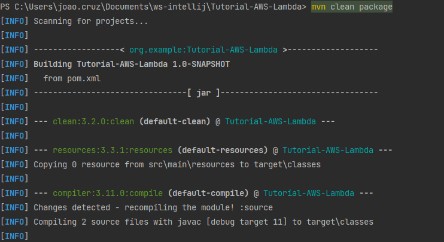

<h1 align="center">
📄<br>Tutorial Lambda AWS
</h1>

Este tutorial ensina como criar e testar uma função Lambda no AWS Lambda e como integrá-la com a API Gateway para criar uma API RESTful.

---

## 🔸 Passo 01: Criar Projeto no java
Primeiramente, você precisará criar um projeto no java (utilize o maven como o gerenciador de pacotes).

---

## 🔸 Passo 02: Inserir as dependências necessárias (aws)

Adicione as seguintes dependências no arquivo pom.xml para permitir a execução do código AWS Lambda:

```
<dependencies>
        <dependency>
            <groupId>com.amazonaws</groupId>
            <artifactId>aws-lambda-java-events</artifactId>
            <version>3.11.2</version>
        </dependency>

        <dependency>
            <groupId>com.amazonaws</groupId>
            <artifactId>aws-lambda-java-core</artifactId>
            <version>1.2.2</version>
        </dependency>
    </dependencies>
```

OBS.: Após adicionar as dependências, recarregue o projeto para que elas sejam reconhecidas.

---

## 🔸 Passo 03: Definir um nome amigável para o projeto (opcional)

No arquivo pom.xml, dentro da seção "build", adicione a tag <finalName> para definir um nome amigável para o seu projeto:

```
 <build>
        <finalName>lambda-function</finalName>
    </build>
```

---

## 🔸 Passo 04: Criar a classe Java para a função Lambda

Crie uma classe Java que implemente a interface RequestHandler com o código da sua função Lambda. Por exemplo:

```
package org.example;

import com.amazonaws.services.lambda.runtime.Context;
import com.amazonaws.services.lambda.runtime.RequestHandler;

public class HelloWorld implements RequestHandler<Object, String> {
    public String handleRequest(Object input, Context context) {
        return "Hello, world!";
    }
}
```

---

## 🔸 Passo 05: Compilar o projeto

No terminal do IntelliJ, execute o comando `mvn clean package` para compilar o projeto. Isso criará um arquivo JAR na pasta "target" do seu projeto.

OBS.: Para rodar esse comando é necessário ter o maven instalado na sua máquina, caso não tenha você pode seguir o seguinte passo a passo:

Na barra do intellij clique nas abas nessa sequência:
1. view
2. tool windows
3. maven


Após isso abrirá uma aba do maven, clique em:
4. Nome do seu pacote
5. lifecycle
6. package
7. Clique em RUN


Após ter usado o comando `mvn clean package` OU ter seguido os passos acimas

Deve aparecer no console a compilação do projeto:


E em seguida será criado uma pasta target no seu projeto, caso você abra haverá um arquivo jar com o nome que foi dado no build


---

## 🔹 Passo 06: Criar a função Lambda no AWS Console

Busque o serviço AWS Lambda

E clique em `criar função`


Após clicar no botão, defina as configurações principais como o nome da sua função lambda, a linguagem de execução e a arquitetura


Além disso é possível é possível configurar a função IAM para sua função lambda na seção `Alterar a função de execução padrão`


Nesse exemplo estou usando uma função padrão que a própria aws já configurou

Por fim, basta clicar em `criar função`

---

## 🔹 Passo 07: Configurar a função Lambda

Parabéns! Se você chegou até aqui é porque você criou a sua função :D 


Agora vamos realizar algumas configurações

Primeiro vamos upar aquele jar que geramos ao executar o `mvn clean package` lembra?

Navegue até a seção de `Origem do código` e clique em fazer upload de: selecione o arquivo .rar

Procure na pasta do projeto, dentro da pasta target o arquivo .jar criado.

Em seguida navegue até a parte `Configurações de tempo de execução` que está no seu menu do AWS LAMBDA


Clique em editar e em seguida renomeie o `Manipulador` da seguinte forma:
`Nome do Pacote`.`Nome da classe`::`Nome do método`

No meu caso é:
`org.example.HelloWorld::handleRequest`


Em seguida clique em `salvar`

Com isso conseguimos mais uma etapa, nossa configuração deu tudo certo (provavelmente).

---

## 🔹 Passo 08: Testar a função Lambda

Vamos testar agora, no menu do AWS Lambda busque o Menu `Testar`


Como nossa função é um simples Hello World, não é necessário fazer grandes configurações, tendo em vista que qualquer evento enviado, retornará o Hello World.

Com isso, basta clicar em `testar`

E txaram! provavelmente uma mensagem de: "Execução da função: bem-sucedida" irá aparecer


---

## ▫️ Passo 09: Criar a API Gateway

Busque o serviço de API Gateway e busque a API REST, clique em compilar


Uma aba de configurações irá ser gerada, selecione as opções:
- REST
- API Nova
- E nomeie a sua API com o nome que desejar

Após isso clique em `criar API`

---

## ▫️ Passo 10: Configurar o recurso e o método GET

Na próxima seção teremos as configurações 


Verifique se na aba a esquerda está selecionado a opção Recursos.

Em seguida, clique no botão `Ações`


Clique em criar método e em seguida selecione o método e clique no check


Será aberto a seguinte página


Na caixa `Função Lambda` você insere a `arn` da sua função lambda, que está na página da sua função lambda, como mostra a imagem abaixo:


Após isso, o seu método GET estará configurado com sucesso 


---

## ▫️ Passo 11: Implantar a API

Nesse passo, clique em ações novamente e clique em implantar API para fazermos o Deploy


Por fim, vamos selecionar o estágio desse deploy e clicar em implante


E agora temos a nossa URL na opção `Invocar URL`


OBS.: Caso você crie uma função para passar parâmetros, talvez seja necessário desmarcar a opção `Ativar controle de utilização`

---

## ▫ Passo 12: Testar a API

Navegue até a opção "Invocar URL" na sua API Gateway para obter a URL da API. Utilize essa URL para testar sua API no navegador ou utilizando ferramentas como o cURL ou Postman.

Com isso, sua função Lambda está integrada à API Gateway e pronta para ser acessada através da URL da API. 

Parabéns! Você criou e testou uma função Lambda no AWS Lambda e a integrou com uma API Gateway.


---

## 👨‍💻 Autor

Nome: João Cruz<br>Linkedin: https://www.linkedin.com/in/joaosilvacruz/

---

<h4 align=center>Made with 💚 by <a href="https://github.com/joaocruzzup">João Cruz</a></h4>
